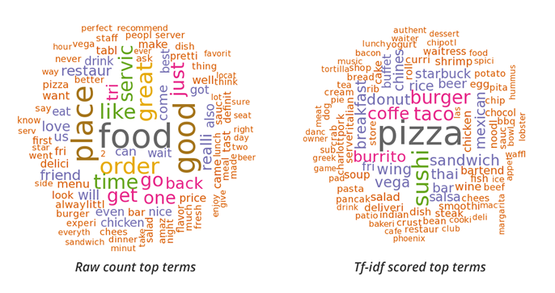
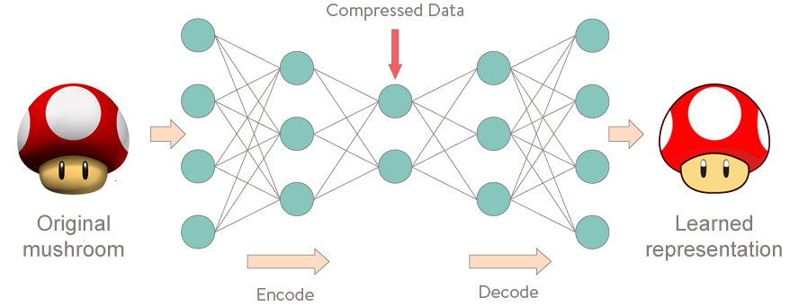

# Data Science Portfolio
---
## Machine Learning, Artificial Intelligence, Data Science, Data Analysis, Deep Learning

### Analysis of Mortgage Backed Securities Prepayment Ability

A Machine Learning Project that can predict whether the customer will default the loan or not. The primary dataset is Feddie Mac's Single Family Loan-Level Dataset.This dataset contains approximately 500,000 mortgages originated between January 1, 1999 and September 30th, 2020. The dataset mainly consists of fixed-rate single family mortgages loans with a maturity of thirty years.

---

### Exploratory Data Analysis on LendingClub Case Study

The data given contains information about past loan applicants and whether they ‘defaulted’ or not.
The aim is to identify patterns which indicate if a person is likely to default, which may be used for taking actions such as denying the loan, reducing the amount of loan, lending (to risky applicants) at a higher interest rate, etc. through Exploratory Data Analysis (EDA) . Thus, we have to understand how consumer attributes and loan attributes influence the tendency of default.

---

### Recommendation System Deployment Through Streamlit

A General purpose Recommender System that can recommend any items such as Movies, Receipes, Books and MOOCs. Used cosine similarity, TF-IDF Vectorization and K Nearest Neighbours to recommend top items from a list of large items. At the end, deployed the machine learning model using Streamlit Sharing to create a Recommender System application.

---

### Twitter Sentiment Analysis

Used sentiment analysis to analyze the tweets and segregate them into various segments like positive, negative and neutral tweets with a model accuracy of 82%.

---

### Yelp Reviews Sentiment Analysis

Used EDA Augmentation and various algorithms such as Random Forest classifier, Logistic Regression, XGBoost, Naive Bayes and Support Vector Machine (SVD) for comparing accuracies and other evaluation metrics.

---

### Document Similarity Measures

Measured similarity between text documents by treating the text the words in the documents as vectors and using various similarity measures such as FuzzyWuzzy, Cosine Similarity and Jaccard Similarity.

---
